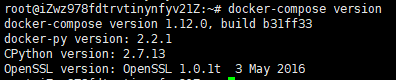

### docker-compose安装过程（3）
1、安装python-pip
```
$ sudo apt-get install python-pip
```
2、下载 Docker-Compose
```
$ curl -L https://get.daocloud.io/docker/compose/releases/download/1.12.0/docker-compose-`uname -s`-`uname -m` > ~/docker-compose

```
3、将Docker-Compose文件夹移动到/usr/local/bin目录下
```
sudo mv ~/docker-compose /usr/local/bin/docker-compose
```
4、为Docker-Compose附上可执行权限
```
chmod +x /usr/local/bin/docker-compose
```
5、检验版本
```
docker-compose version
```
效果如下：


