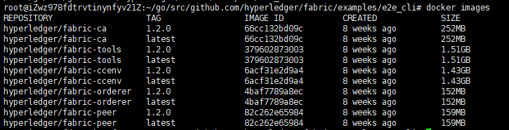
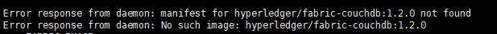

### hyperledger-fabric安装部署
1、在go工作环境目录中创建fabric文件目录
```
$ mkdir -p ~/go/src/github.com/hyperledger
```
2、初始化git环境
```
$ cd ~/go/src/github.com/hyperledger
$ git init
```
3、clone fabric源码
```
$ git clone https://github.com/hyperledger/fabric.git
$ git checkout v1.2.0
```
4、下载fabric docker镜像
```
$ cd ~/go/src/github.com/hyperledger/fabric/examples/e2e_cli
$ bash download-dockerimages.sh -c 1.2.0 -f 1.2.0
```
5、查看结果
```
$ docker images
```
效果如下：



在该过程中会出现错误如下：

上述现象是由于版本库中没有指定tag版本的镜像所致。
##### 解决方案一：通过查看https://hub.docker.com/u/hyperledger/
```
通过上述网址，查看缺失的镜像最新版本，然后单独下载。
如：$ docker pull docker pull hyperledger/fabric-couchdb:x86_64-1.0.6
```
##### 解决方案二：再次运行download-dockerimages.sh
注意在执行是不指定版本
```
$ bash download-dockerimages.sh
```
