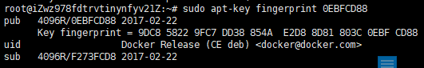
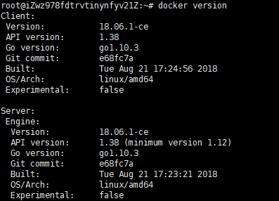
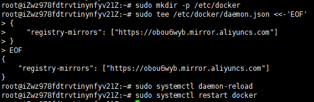

### docker环境配置（1）
##### 版本说明
```
最低要求：
docker version：17.06.2-ce
本项目版本：
docker version：18.06.1-ce
阿里云ubuntu16.04系统
```
######　步骤
1、卸载刘版本docker
```
$  sudo apt-get remove docker docker-engine docker.io
```
2、更新apt包索引
```
$ sudo apt-get update
```
3、安装软件包以允许apt通过HTTPS使用远程库
```
$ sudo apt-get install apt-transport-https ca-certificates curl software-properties-common
```
4、添加Docker的官方GPG密钥
```
$ curl -fsSL https://download.docker.com/linux/ubuntu/gpg | sudo apt-key add -
```
5、通过搜索指纹的最后8个字符，确认您现在拥有指纹识别码
```
$ sudo apt-key fingerprint 0EBFCD88
```
效果如下：


6、设置稳定版本的远程库
```
$ sudo add-apt-repository \
  "deb [arch=amd64] https://download.docker.com/linux/ubuntu \
  $(lsb_release -cs) \
  stable"
```
7、重新更新apt包索引
```
$ sudo apt-get update
```
8、安装docker-ca
```
$ sudo apt-get install docker-ce
```
9、检验安装效果
```
docker version
```
效果如下图：


10、将当前用户添加到docker用户组，然后为该用户添加sudo权限
```
$ sudo groupadd –g 999 docker #创建docker用户组
$ sudo usermod -aG docker root 将当前用户(root)添加到docker用户组并分配sudo权限
```
11、阿里云的Docker Hub镜像
```
$ sudo mkdir -p /etc/docker
$ sudo tee /etc/docker/daemon.json <<-'EOF'
{
    "registry-mirrors": ["https://obou6wyb.mirror.aliyuncs.com"]
}
EOF
$ sudo systemctl daemon-reload
$ sudo systemctl restart docker
```
效果如下图：


